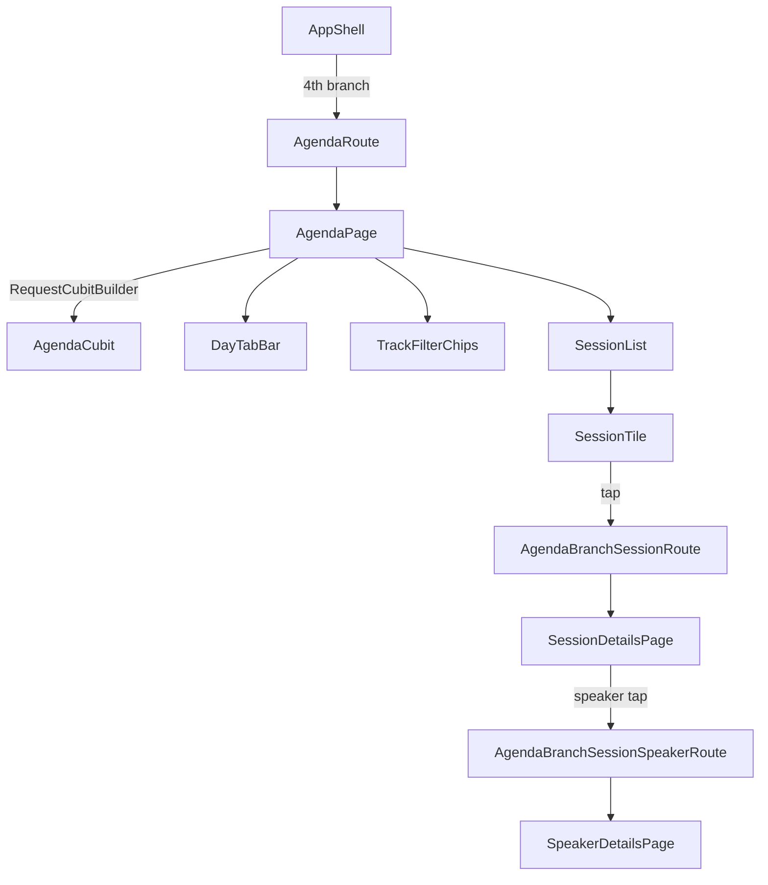

# LedFX effects activator 

A personal assistant project that aims to activate prepared LedFX effects on LED strips/devices at specific moments in the video using LedFX API + React/ReactPlayer.

```mermaid
flowchart TD
    AppShell -->|4th branch| AgendaRoute
    AgendaRoute --> AgendaPage
    AgendaPage -->|RequestCubitBuilder| AgendaCubit
    AgendaPage --> DayTabBar
    AgendaPage --> TrackFilterChips
    AgendaPage --> SessionList
    SessionList --> SessionTile
    SessionTile -->|tap| AgendaBranchSessionRoute
    AgendaBranchSessionRoute --> SessionDetailsPage
    SessionDetailsPage -->|speaker tap| AgendaBranchSessionSpeakerRoute
    AgendaBranchSessionSpeakerRoute --> SpeakerDetailsPage
```
